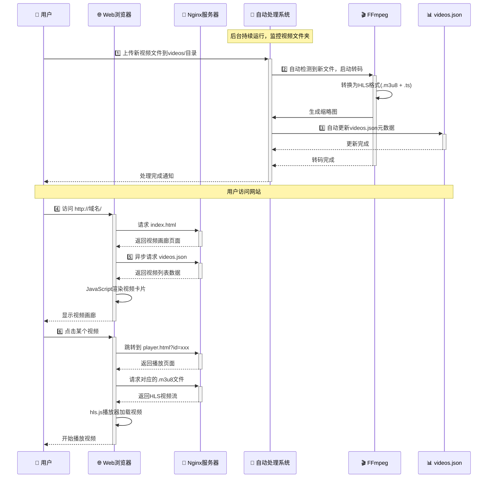
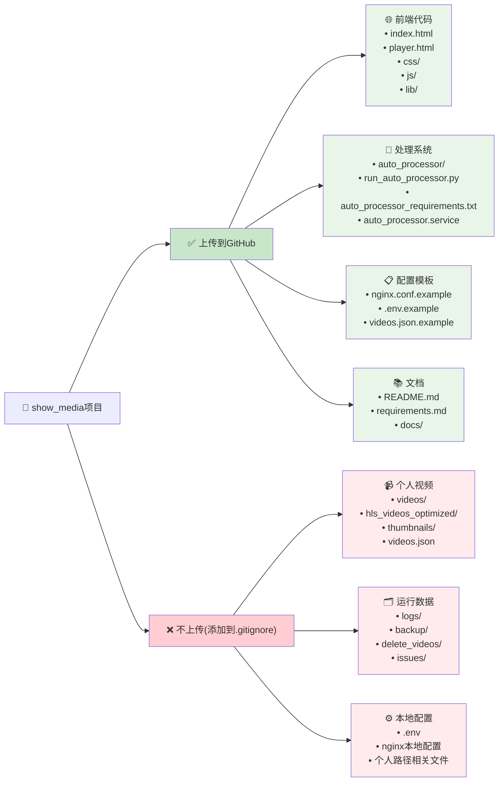

# 🎬 Project Miniflix

> 一个现代化、美观、响应式的个人视频展示平台
> 
> **基于 HLS 流媒体技术 + 智能自动化处理系统**


---

## 📋 核心特性

- 🎨 **现代化UI设计** - 响应式卡片布局，适配桌面和移动设备
- 🎞️ **HLS流媒体播放** - 基于hls.js的高性能视频播放体验
- 🤖 **智能自动处理** - 自动监控、转码、生成缩略图和更新数据库
- ⚡ **高性能架构** - Nginx + 静态文件 + 缓存优化
- 🔧 **易于维护** - 模块化代码结构，JSON数据管理
- 📱 **完全响应式** - 在各种设备上都有优秀的用户体验

---

## 🏗️ 项目架构

```mermaid
graph TD
    A["🎬 Project Miniflix<br/>视频展示平台"] --> B["📁 代码部分<br/>(上传GitHub)"]
    A --> C["💾 数据部分<br/>(本地私有，不上传)"]
    
    B --> B1["🌐 前端代码"]
    B --> B2["🤖 自动处理系统"] 
    B --> B3["📋 配置文件"]
    B --> B4["📚 文档说明"]
    
    B1 --> B11["index.html<br/>视频画廊主页"]
    B1 --> B12["player.html<br/>视频播放页面"]
    B1 --> B13["css/ 样式文件"]
    B1 --> B14["js/ JavaScript逻辑"]
    B1 --> B15["lib/ hls.js库"]
    
    B2 --> B21["auto_processor/<br/>Python处理系统"]
    B2 --> B22["run_auto_processor.py<br/>启动脚本"]
    B2 --> B23["auto_processor_requirements.txt<br/>依赖包清单"]
    
    B3 --> B31["auto_processor.service<br/>系统服务配置"]
    B3 --> B32["nginx配置示例<br/>(如果需要)"]
    
    B4 --> B41["README.md<br/>使用说明"]
    B4 --> B42["requirements.md<br/>需求文档"]
    
    C --> C1["📹 原始视频文件"]
    C --> C2["🎞️ 处理后的HLS文件"]
    C --> C3["🖼️ 视频缩略图"]
    C --> C4["📊 视频数据库"]
    C --> C5["📝 运行日志"]
    
    C1 --> C11["videos/<br/>原始mp4等格式"]
    C2 --> C21["hls_videos_optimized/<br/>转码后的.m3u8和.ts文件"]
    C3 --> C31["thumbnails/<br/>视频封面图片"]
    C4 --> C41["videos.json<br/>视频元数据"]
    C5 --> C51["logs/<br/>系统运行日志"]
    C5 --> C52["backup/<br/>备份文件"]
    
    style B fill:#e1f5fe
    style C fill:#fff3e0
    style B1 fill:#f3e5f5
    style B2 fill:#e8f5e8
    style C1 fill:#ffebee
    style C2 fill:#ffebee
    style C3 fill:#ffebee
    style C4 fill:#ffebee
```



---

## ⚡ 工作原理



---

## 🚀 快速开始

### 环境要求

- **Python 3.7+**
- **FFmpeg & FFprobe** (系统级安装)
- **Nginx** (推荐，也可用其他Web服务器)
- **Linux/macOS** (推荐，Windows需要额外配置)

### 安装步骤

1. **克隆项目**
```bash
git clone https://github.com/your-username/project-miniflix.git
cd project-miniflix
```

2. **安装Python依赖**
```bash
pip install -r auto_processor_requirements.txt
```

3. **安装系统依赖**
```bash
# Ubuntu/Debian
sudo apt update
sudo apt install ffmpeg nginx

# CentOS/RHEL
sudo yum install epel-release
sudo yum install ffmpeg nginx

# macOS
brew install ffmpeg nginx
```

4. **配置目录结构**
```bash
mkdir -p videos thumbnails hls_videos_optimized logs backup
```

5. **创建初始配置**
```bash
# 复制示例配置
cp videos.json.example videos.json

# 编辑配置文件，添加您的视频信息
nano videos.json
```

### 运行项目

#### 方式一：开发模式
```bash
# 启动自动处理系统(测试模式)
python run_auto_processor.py --test

# 启动Web服务器(另一个终端)
python -m http.server 8000
# 访问: http://localhost:8000
```

#### 方式二：生产模式
```bash
# 启动自动处理系统
python run_auto_processor.py

# 配置并启动Nginx
sudo cp nginx.conf.example /etc/nginx/sites-available/miniflix
sudo ln -s /etc/nginx/sites-available/miniflix /etc/nginx/sites-enabled/
sudo systemctl reload nginx
```

#### 方式三：系统服务
```bash
# 安装为系统服务
sudo cp auto_processor.service /etc/systemd/system/
sudo systemctl daemon-reload
sudo systemctl enable auto_processor
sudo systemctl start auto_processor

# 查看运行状态
python run_auto_processor.py --status
```

---

## 📁 项目结构

```
project-miniflix/
├── 🌐 前端文件
│   ├── index.html              # 视频画廊主页
│   ├── player.html             # 视频播放页面
│   ├── css/
│   │   └── style.css           # 样式文件
│   ├── js/
│   │   ├── gallery.js          # 画廊逻辑
│   │   └── player.js           # 播放器逻辑
│   └── lib/
│       └── hls.min.js          # HLS.js 库
│
├── 🤖 自动处理系统
│   ├── auto_processor/         # 核心处理模块
│   │   ├── main_processor.py   # 主处理器
│   │   ├── video_processor.py  # 视频处理
│   │   ├── file_monitor.py     # 文件监控
│   │   ├── video_analyzer.py   # 视频分析
│   │   └── config.py           # 配置管理
│   ├── run_auto_processor.py   # 启动脚本
│   └── auto_processor_requirements.txt
│
├── ⚙️ 配置文件
│   ├── auto_processor.service  # Systemd服务配置
│   ├── videos.json.example     # 视频数据示例
│   └── nginx.conf.example      # Nginx配置示例
│
├── 📚 文档
│   ├── README.md               # 本文件
│   ├── requirements.md         # 详细需求文档
│   └── docs/                   # 其他文档
│
└── 📁 数据目录 (运行时创建，不上传Git)
    ├── videos/                 # 原始视频文件
    ├── hls_videos_optimized/   # HLS转码输出
    ├── thumbnails/             # 视频缩略图
    ├── videos.json             # 视频数据库
    ├── logs/                   # 系统日志
    └── backup/                 # 备份文件
```

---

## 🛠️ 使用说明

### 添加新视频

1. **放置视频文件**
```bash
# 将视频文件放入videos目录
cp your-video.mp4 videos/
```

2. **自动处理**
   - 如果自动处理系统正在运行，会自动检测并处理
   - 处理包括：HLS转码、生成缩略图、更新数据库

3. **手动处理**
```bash
# 扫描并处理现有文件
python run_auto_processor.py --scan-only
```

### 系统管理

```bash
# 查看系统状态
python run_auto_processor.py --status

# 停止服务
python run_auto_processor.py --stop

# 测试模式运行
python run_auto_processor.py --test
```

### 配置文件说明

#### `videos.json` 格式
```json
[
  {
    "id": "unique-video-id",
    "title": "视频标题",
    "description": "视频描述",
    "thumbnail": "thumbnails/video-thumb.jpg",
    "hls_url": "hls_videos_optimized/video.m3u8",
    "duration": "mm:ss"
  }
]
```

---

## 📊 GitHub上传策略



---

## 🔧 高级配置

### HTTPS配置

1. **获取SSL证书**
```bash
# 使用Let's Encrypt
sudo certbot --nginx -d your-domain.com
```

2. **Nginx HTTPS配置**
```nginx
server {
    listen 443 ssl;
    server_name your-domain.com;
    
    ssl_certificate /path/to/cert.pem;
    ssl_certificate_key /path/to/key.pem;
    
    # ... 其他配置
}
```

### 端口修改

修改Nginx配置文件中的 `listen` 指令：
```nginx
# 自定义端口
listen 8080;
# 或 HTTPS自定义端口
listen 8443 ssl;
```

### 多站点部署

```nginx
# 基于域名的虚拟主机
server {
    server_name video.yourdomain.com;
    # Miniflix配置
}

server {
    server_name api.yourdomain.com;
    # 其他应用配置
}
```

---

## 🐛 常见问题 (QA)

### Q: 视频上传后没有自动处理？
**A:** 检查自动处理系统是否正在运行：
```bash
python run_auto_processor.py --status
```

### Q: 视频播放失败？
**A:** 检查以下几点：
1. HLS文件是否正确生成
2. Nginx配置是否正确
3. 浏览器是否支持HLS
4. 网络连接是否正常

### Q: 如何批量处理现有视频？
**A:** 使用扫描命令：
```bash
python run_auto_processor.py --scan-only
```

### Q: 如何修改视频质量设置？
**A:** 编辑 `auto_processor/config.py` 中的FFmpeg参数。

---

## 📈 更新历史

- **v1.0.0** (2024-01-XX) - 初始版本发布
- **v1.1.0** (2024-XX-XX) - 添加自动处理系统
- **v1.2.0** (2024-XX-XX) - 优化UI设计和性能

---

## 🤝 贡献指南

1. Fork 本项目
2. 创建您的特性分支 (`git checkout -b feature/AmazingFeature`)
3. 提交您的修改 (`git commit -m 'Add some AmazingFeature'`)
4. 推送到分支 (`git push origin feature/AmazingFeature`)
5. 打开一个 Pull Request

---

## 📜 许可证

本项目采用 MIT 许可证 - 查看 [LICENSE](LICENSE) 文件了解详情。

---

## 👏 致谢

- [hls.js](https://github.com/video-dev/hls.js/) - 优秀的HLS播放器库
- [FFmpeg](https://ffmpeg.org/) - 强大的视频处理工具
- [Nginx](https://nginx.org/) - 高性能Web服务器

---

<div align="center">

**🎬 Project Miniflix - 让视频分享变得简单美好**

Made with ❤️ by [Your Name]

[⭐ Star](https://github.com/your-username/project-miniflix) | [🐛 Report Bug](https://github.com/your-username/project-miniflix/issues) | [💡 Request Feature](https://github.com/your-username/project-miniflix/issues)

</div>
